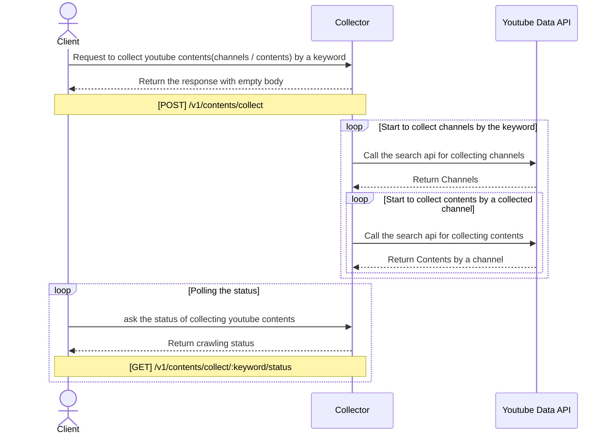

# Channel Contents Collector

유튜브 컨텐츠(채널 / 비디오) 정보를 키워드에 따라 채널 / 컨텐츠 정보를 수집합니다.

## Flow
유튜브 컨텐츠 정보를 수집하기 위해 키워드를 입력받고, 이후 채널 / 컨텐츠에 대한 데이터 수집을 시작합니다.
수집 요청을 받고 수집하는 단계까지 3가지로 나누어 표현하면 아래 흐름과 같습니다.

1. 유튜브 컨텐츠 수집 요청
2. 컨텐츠 수집 시작
3. 수집 상태를 Polling 하는 API 제공
